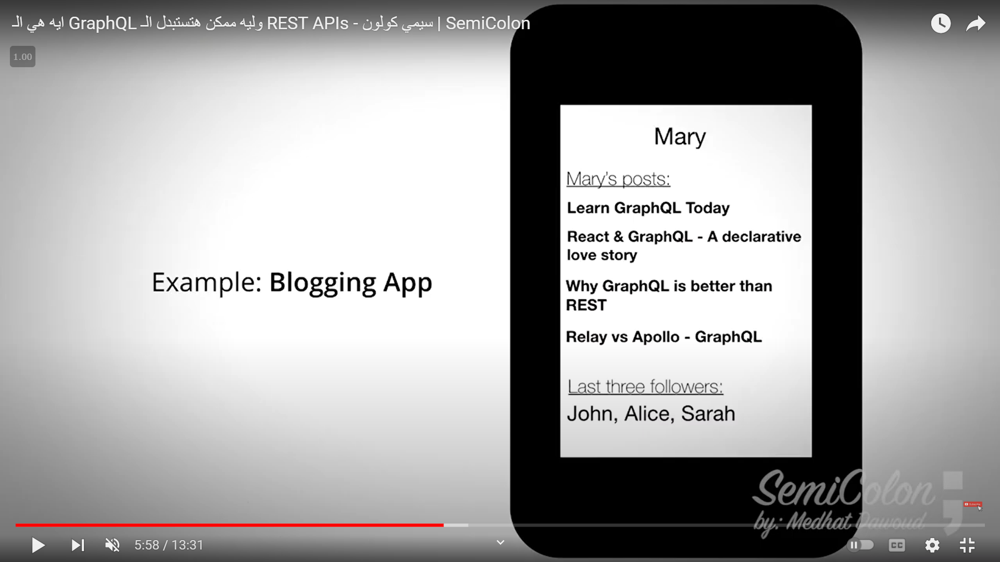
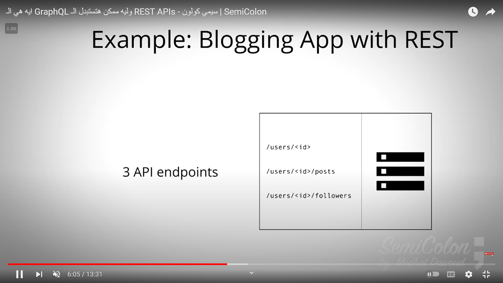
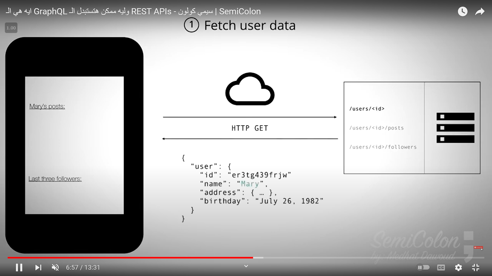
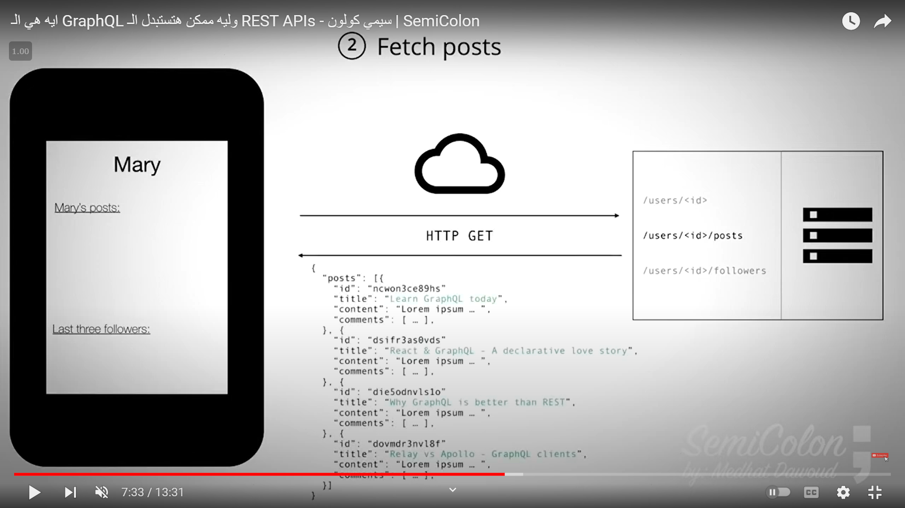
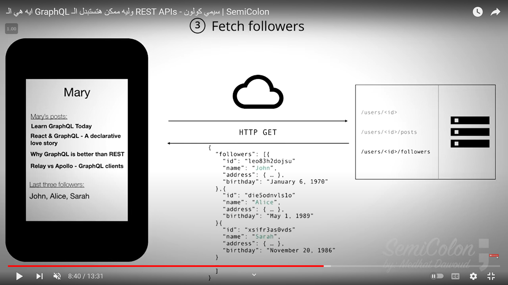
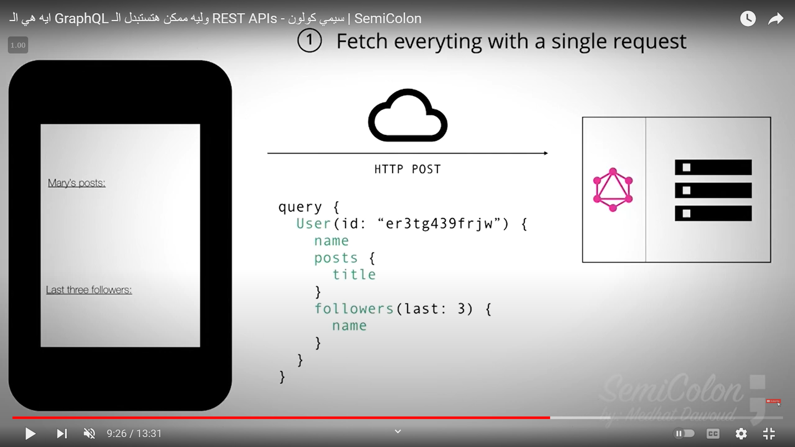
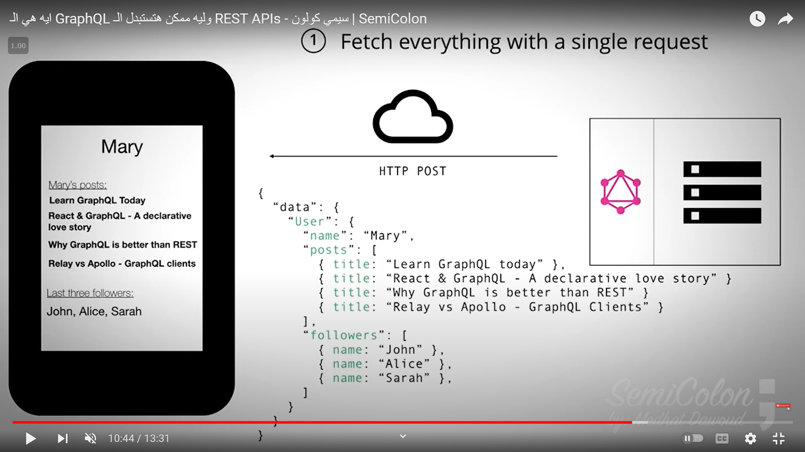
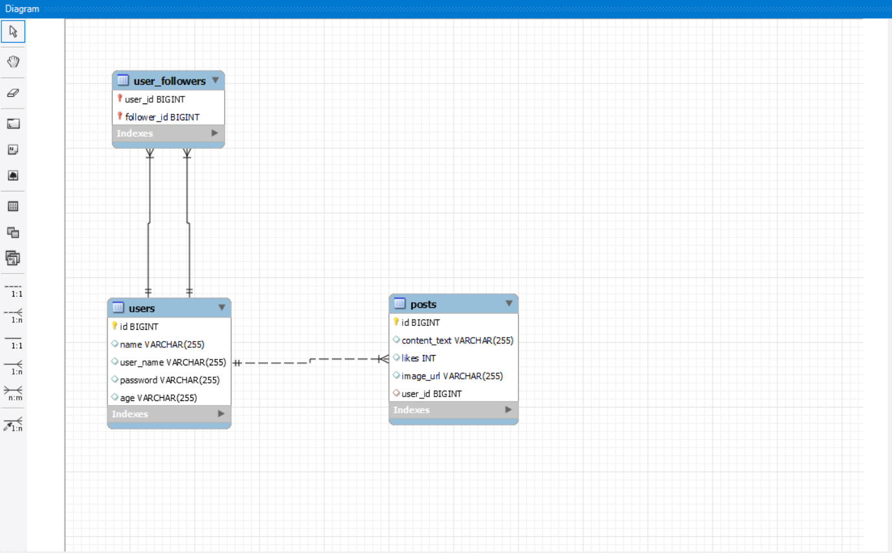

# Spring Boot GraphQL (Blog App) Example

This project demonstrates how to integrate GraphQL with Spring Boot, utilizing MySQL for data persistence. It features basic CRUD operations for users and posts, along with a follow functionality between users in a Blog App.

## Explain How It Works Both (REST, GraphQL) example
- What we want to create to our front-end
  
- the following images will start discuss if we use normal REST Apis and if we use GraphQL
  - here we need to create 3 endpoints to achieve our front-end
    
  - first call to retrieve user info
    
  - second call to retrieve all posts of specific user
    
  - third call to retrieve all followers of specific user
    
  - the problem here that we make multiple request and retrieve multiple un-wanted data

- the following images start to discuss the use of GraphQL
   - prepare the GraphQl Query to fetch all needed data
     
   - data returned from back-end
     
   - display the data into front-end
     
## Technologies Used

- **Spring Boot**: Framework for building the application.
- **GraphQL**: Query language and runtime for your API.
- **MySQL**: Relational database management system.
- **Hibernate**: ORM (Object-Relational Mapping) framework for JPA.
- **Maven**: Dependency management and build automation tool.

## Getting Started

To run this project locally, follow these steps:

### Prerequisites

Make sure you have the following installed:

- Java Development Kit (JDK), preferably JDK 8 or higher
- Maven
- MySQL (running locally)

### Installation

1. **Clone the repository**:

   ```bash
   git clone https://github.com/youssefGamalMohamed/spring-boot-graphQL.git
   cd spring-boot-graphQL
   ```

2. **Configure MySQL**:

    - Create a MySQL database named `blogs_db`.
    - Update `application.yml` with your MySQL username and password if different.

   

3. **Run the Application**:

   ```bash
   mvn spring-boot:run
   ```

4. **Explore GraphQL APIs**:

   Open your browser and go to `http://localhost:9091/blogs/graphql` to access the GraphQL playground. Here, you can execute queries and mutations defined in the schema.

### GraphQL Operations

#### Queries

- **`findAllUsers`**: Retrieves all users and their details.

#### Mutations

- **`createUser`**: Creates a new user.
- **`deleteUser`**: Deletes a user by ID.
- **`updateUser`**: Updates user details.
- **`followUser`**: Enables one user to follow another.

### Example GraphQL Query

To fetch all users and their posts, followers, and following relationships:

```graphql
query {
    findAllUsers {
        id
        name
        userName
        age
        posts {
            id
            contentText
            likes
            imageUrl
        }
        followers {
            id
            name
            userName
        }
        following {
            id
            name
            userName
        }
    }
}
```

### Example GraphQL Mutation

To create a new user:

```graphql
mutation {
    createUser(name: "John Doe", userName: "johndoe", password: "password123", age: "30") {
        id
        name
        userName
        age
    }
}
```
